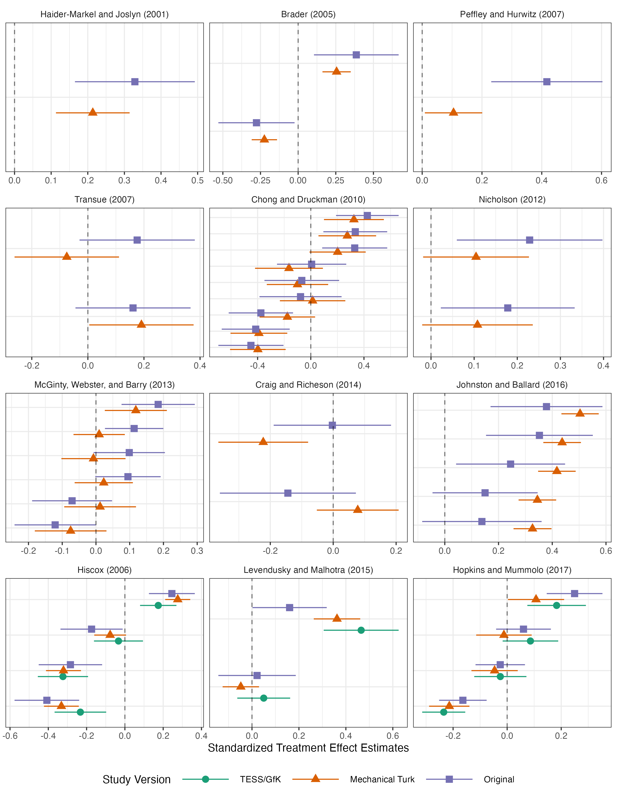
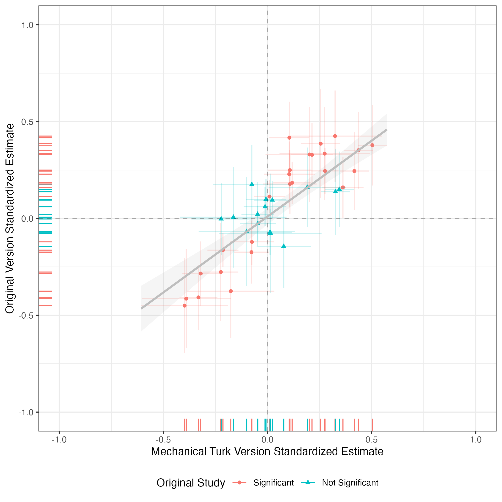
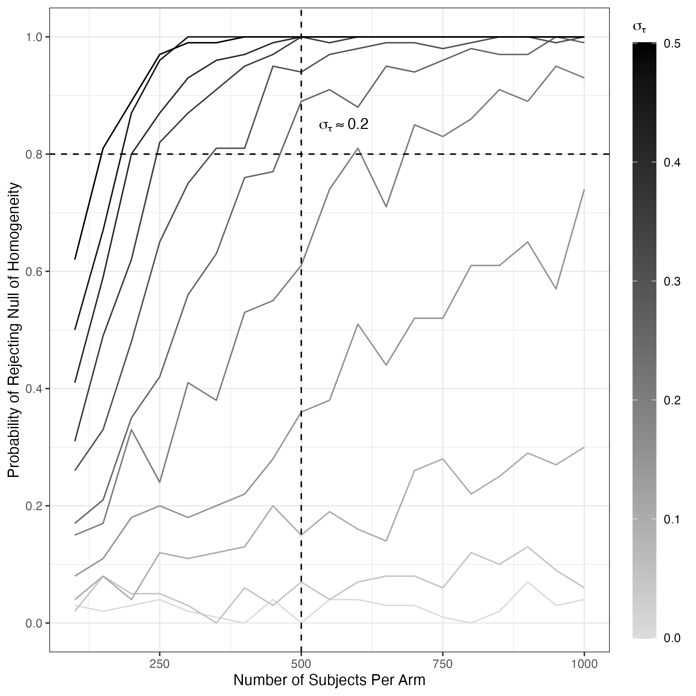

# Active Maintenance Report: coppock_2019a


- [Paper overview](#paper-overview)
- [Summary](#summary)
  - [Does the deposited archive run?](#does-the-deposited-archive-run)
  - [Does the maintained rewrite reproduce the
    paper?](#does-the-maintained-rewrite-reproduce-the-paper)
- [Original archive reproducibility](#original-archive-reproducibility)
  - [Filename case](#filename-case)
  - [The archive writes into itself](#the-archive-writes-into-itself)
  - [The standard error package no longer
    exists](#the-standard-error-package-no-longer-exists)
- [Number-by-number comparison](#number-by-number-comparison)
  - [Table 2 in full](#table-2-in-full)
- [Maintained rewrite](#maintained-rewrite)
  - [Deprecated patterns replaced](#deprecated-patterns-replaced)
  - [What the rewrite does not cover](#what-the-rewrite-does-not-cover)
  - [Determinism](#determinism)
- [Figures](#figures)
- [Tables](#tables)
- [Maintained rewrite verification](#maintained-rewrite-verification)
- [R environment](#r-environment)

This repository holds the actively maintained replication code for
Coppock (2019), together with the reproducibility report that documents
what the original archive did and did not do. It is part of a program
applying the maintenance proposal in Peer, Orr and Coppock (2021, *PS:
Political Science & Politics*, doi
[10.1017/S1049096521000366](https://doi.org/10.1017/S1049096521000366))
to a set of published archives.

|  |  |
|----|----|
| Article | [10.1017/psrm.2018.10](https://doi.org/10.1017/psrm.2018.10) |
| Replication archive | [10.7910/DVN/F1CFFM](https://doi.org/10.7910/DVN/F1CFFM) |

**The data are not redistributed here.** The deposit is 38 files at
Harvard Dataverse, which is the only copy this repository points at.
`download_original.R` fetches it and verifies every file;
`original_manifest.csv` pins the file identifiers, sizes and checksums,
so the exact bytes this code was written against are recorded in version
control even though the bytes themselves are not.

**Repository layout.** `maintained/` is the maintained rewrite: one
script per published table or figure, writing to `output/`, which is
committed so a reader can compare a fresh run against it without
downloading anything. `ground_truth/` ties every published number to the
code that produces it. `original/` is created by the download script and
is deliberately absent from the repository. This README is the
reproducibility report, also available as a PDF in `report/`.

**License.** CC0 1.0 Universal, matching the terms of the deposit this
repository maintains. See `LICENSE`.

**To reproduce.** Clone or download the repository, open
`coppock_2019a.Rproj`, and run:

``` r
source("run_all.R")
```

That fetches the deposit, verifies its 38 files, and produces every
table and figure into `maintained/output/`. Required packages:
tidyverse, sandwich, lmtest, estimatr, metap, knitr, kableExtra, here.
`metap` depends on `multtest` from Bioconductor, so it needs
`BiocManager::install("multtest")` before `install.packages("metap")`.
Paths resolve through `here`, so nothing depends on the working
directory. A full run takes about a minute, most of it
`table_2_ri_heterogeneity.R` recomputing 90 randomization inference
tests. A successful run overwrites `maintained/output/`, which is
committed: **`git diff` on that folder is the reproduction check.**

# Paper overview

**Citation**: Coppock, A. (2019). “Generalizing from Survey Experiments
Conducted on Mechanical Turk: A Replication Approach.” *Political
Science Research and Methods*, 7(3), 613-628. DOI: 10.1017/psrm.2018.10

**Replication archive**: <https://doi.org/10.7910/DVN/F1CFFM>

**Summary**: The paper asks whether average treatment effects estimated
on Mechanical Turk generalize to national probability samples. Fifteen
survey experiments, originally fielded on probability or convenience
samples, were replicated on MTurk, and seven were replicated a second
time on TESS/GfK national probability samples. Treatments are framing,
priming and information manipulations; outcomes are attitudes,
standardized by the control group standard deviation in the original
study. Effects are estimated by difference in means with Neyman (HC2)
standard errors. Across 40 treatment-versus-control comparisons the
MTurk and original estimates correlate at 0.85, and a randomization
inference test of the null of treatment effect homogeneity rarely
rejects, which is the mechanism the paper offers for why the samples
agree.

------------------------------------------------------------------------

# Summary

Two questions, answered before the detail.

## Does the deposited archive run?

Not as deposited, and the reasons split cleanly into the trivial and the
substantive.

The trivial ones are two absent packages and a systematic path error.
`metap`, used to combine p-values by Fisher’s method, is not installed
by default and pulls `multtest` from Bioconductor. `commarobust`, which
supplies every standard error in the paper, was never on CRAN and now
cannot be installed in working form at all; that one is treated below,
because it has outgrown the trivial category. The path error is that
eight `load()` calls name files ending `.rdata` when the deposited files
end `.RData`. macOS does not care and Linux does, so six of the
archive’s seven scripts fail on their first data load on any
case-sensitive filesystem. Nothing about the analysis is wrong; the
archive simply cannot start.

The substantive ones are three.

First, two mistyped `sink()` calls silently destroyed two of the
archive’s own outputs. At line 249 of
`coppock_generalizability_appendix.R`, a `sink()` naming Table 1’s file
stands where a bare `sink()` was meant, so instead of closing the Table
6 sink it reopens Table 1’s file and truncates it: the deposited
`..._table_1.txt` is zero bytes. At line 566 the same script writes
Table 15’s results to `..._table_5.txt`, overwriting the Patriot Act
table that belongs there. The deposited `..._table_5.txt` contains the
terrorism spending results, and no `..._table_15.txt` exists. Both
errors are silent, and both survived into the published deposit.

Second, the uncorrected counts in Table 2 do not come back. The cause is
not a bug in the archive but the change R 3.6.0 made to `sample()`,
which replaced the rounding sampler with the rejection sampler and so
changed which permutations a given seed draws. Setting
`RNGkind(sample.kind = "Rounding")` and rerunning reproduces the
deposited output exactly, 2 and 9 and 1 across the three samples, where
the current sampler gives 1 and 8 and 1. The archive is reproducible; it
is reproducible under the R of 2018.

Third, and separately from anything R did, the published Table 2
disagrees with the paper’s own text and with the archive. Table 2
reports 1, 9 and 2 significant tests for the original, MTurk and
TESS/GfK samples; the text on the facing page says 1, 8 and 0. The
archive produces 2, 9 and 1 as deposited. No single run of the code
produces the published column. The Holm-corrected column, which is the
one the argument rests on, reproduces exactly under both samplers.

## Does the maintained rewrite reproduce the paper?

For 50 of 52 recorded claims, yes. The correlations that carry the
paper’s argument reproduce to the reported precision (0.85, 0.90, 0.96,
0.85), as do the 72.5 percent replication rate, every checked Table A1
estimate, and every cell of Table 2 except two.

The 2 that do not match are the uncorrected significant-test counts for
MTurk and TESS/GfK in Table 2, for the reasons above: they are
sampler-dependent, and the published values are not reproducible from
the archive under any sampler. The rewrite reports what current R
produces rather than reproducing the 2018 draw, because pinning a
deprecated sampler to recover a specific integer would document the
number rather than the finding. The substantive claim, that these tests
rarely reject the null of treatment effect homogeneity, holds in every
version: at most 9 of 40 comparisons reject before correction and at
most 8 after.

------------------------------------------------------------------------

# Original archive reproducibility

| Script | Status on current R | Resolution |
|:---|:---|:---|
| coppock_generalizability_ri_functions.R | Clean (sourced by others; defines no paths) | No changes required |
| coppock_generalizability_analysis.R | Fails on load(); fails again on commarobust | Correct the filename case; inline the retired commarobust call |
| coppock_generalizability_figures.R | Fails on load() | Correct the filename case |
| coppock_generalizability_table.R | Fails on load() | Correct the filename case |
| coppock_generalizability_ri_analysis.R | Fails on load(); fails again on metap and commarobust | Correct the filename case; install multtest and metap |
| coppock_generalizability_simulation.R | Fails on load() | Correct the filename case |
| coppock_generalizability_appendix.R | Fails on load(); writes two outputs to the wrong file | Correct the filename case; correct two sink() calls |

Original archive reproducibility, checked against R 4.6.0 on a
case-sensitive reading of the deposited filenames.

## Filename case

Every deposited data file ends `.RData`. Every script asks for `.rdata`:

| Call site | Filename requested |
|:---|:---|
| coppock_generalizability_analysis.R:20 | coppock_generalizability_studies.rdata |
| coppock_generalizability_figures.R:21 | coppock_generalizability_analysis_results.rdata |
| coppock_generalizability_figures.R:22 | coppock_generalizability_study_data.rdata |
| coppock_generalizability_table.R:22 | coppock_generalizability_analysis_results.rdata |
| coppock_generalizability_table.R:23 | coppock_generalizability_study_data.rdata |
| coppock_generalizability_ri_analysis.R:20 | coppock_generalizability_studies.rdata |
| coppock_generalizability_appendix.R:20 | coppock_generalizability_studies.rdata |
| coppock_generalizability_simulation.R:60 | coppock_generalizability_simulation_results.rdata |

The eight load() calls whose case does not match the deposited files.
Each deposited counterpart ends .RData.

The same defect had propagated into the maintained rewrite, whose six
`load()` calls were copied from the archive. They are corrected here.

## The archive writes into itself

Six of the archive’s scripts write their outputs into the archive
directory, and five of those outputs are themselves deposited files.
Running the deposit in place therefore overwrites part of the deposit:
`coppock_generalizability_analysis_results.RData`, the three figure
PDFs, and `coppock_generalizability_table_2.txt` all change. A seventh
file, `ri_results.rdata`, is created and is not part of the deposit at
all. Rerunning `download_original.R` restores everything, which is the
reason the manifest records checksums rather than trusting whatever
happens to be on disk.

## The standard error package no longer exists

Every estimate in the paper passes through
`commarobust::commarobust_tidy()`. `commarobust` was never on CRAN. Its
author retired it in November 2018 in favour of `estimatr`; the current
GitHub head contains one function, a startup message reading “the
commarobust package has been entirely replaced by the estimatr package”,
and exports nothing. Installing it from the default branch and calling
`commarobust::commarobust` raises “not an exported object”. The last
working code sits on a branch named `legacy`.

An archive whose standard errors depend on an unversioned GitHub branch
is exposed to a decision nobody in this project controls, so the rewrite
does not depend on it. The retired `commarobust(fit)` was exactly

``` r
lmtest::coeftest(fit, sandwich::vcovHC(fit, type = "HC2"))
```

and that call is inlined in `maintained/helpers.R`. HC2 is the Neyman
variance the paper reports. Reproduction is exact to floating point:
across the 90 estimates the largest disagreement with the values the
rewrite produced when `commarobust` still installed is 5e-14 in the
point estimates and 1e-14 in the standard errors.

------------------------------------------------------------------------

# Number-by-number comparison

| Location | Quantity                            |  Paper |  Script | Match |
|:---------|:------------------------------------|-------:|--------:|------:|
| text     | cor_mt_original_all                 |  0.850 |  0.8512 |     1 |
| text     | cor_mt_original_gfk_subset          |  0.900 |  0.9017 |     1 |
| text     | cor_mt_gfk                          |  0.960 |  0.9582 |     1 |
| text     | cor_gfk_original                    |  0.850 |  0.8517 |     1 |
| text     | n_orig_sig                          | 25.000 | 25.0000 |     1 |
| text     | n_orig_sig_replicated_in_mt         | 18.000 | 18.0000 |     1 |
| text     | n_orig_nonsig                       | 15.000 | 15.0000 |     1 |
| text     | n_orig_nonsig_also_nonsig_mt        | 11.000 | 11.0000 |     1 |
| text     | overall_replication_rate            |  0.725 |  0.7250 |     1 |
| table_2  | ri_original_n_comparisons           | 40.000 | 40.0000 |     1 |
| table_2  | ri_original_n_sig                   |  1.000 |  1.0000 |     1 |
| table_2  | ri_original_n_sig_holm              |  0.000 |  0.0000 |     1 |
| table_2  | ri_mt_n_comparisons                 | 40.000 | 40.0000 |     1 |
| table_2  | ri_mt_n_sig                         |  9.000 |  8.0000 |     0 |
| table_2  | ri_mt_n_sig_holm                    |  8.000 |  8.0000 |     1 |
| table_2  | ri_gfk_n_comparisons                | 10.000 | 10.0000 |     1 |
| table_2  | ri_gfk_n_sig                        |  2.000 |  1.0000 |     0 |
| table_2  | ri_gfk_n_sig_holm                   |  0.000 |  0.0000 |     1 |
| table_a1 | concealed_carry_original_est        |  0.330 |  0.3300 |     1 |
| table_a1 | concealed_carry_original_se         |  0.080 |  0.0800 |     1 |
| table_a1 | concealed_carry_mt_est              |  0.210 |  0.2100 |     1 |
| table_a1 | concealed_carry_mt_se               |  0.050 |  0.0500 |     1 |
| table_a1 | immigration_neg_impact_original_est | -0.280 | -0.2800 |     1 |
| table_a1 | immigration_neg_impact_original_se  |  0.130 |  0.1300 |     1 |
| table_a1 | immigration_neg_impact_mt_est       | -0.220 | -0.2200 |     1 |
| table_a1 | immigration_neg_impact_mt_se        |  0.040 |  0.0400 |     1 |
| table_a1 | immigration_support_original_est    |  0.390 |  0.3900 |     1 |
| table_a1 | immigration_support_original_se     |  0.140 |  0.1400 |     1 |
| table_a1 | immigration_support_mt_est          |  0.260 |  0.2600 |     1 |
| table_a1 | immigration_support_mt_se           |  0.050 |  0.0500 |     1 |
| table_a1 | death_penalty_original_est          |  0.420 |  0.4200 |     1 |
| table_a1 | death_penalty_original_se           |  0.090 |  0.0900 |     1 |
| table_a1 | death_penalty_mt_est                |  0.100 |  0.1000 |     1 |
| table_a1 | death_penalty_mt_se                 |  0.050 |  0.0500 |     1 |
| table_a1 | free_trade_expert_original_est      |  0.250 |  0.2500 |     1 |
| table_a1 | free_trade_expert_original_se       |  0.060 |  0.0600 |     1 |
| table_a1 | free_trade_expert_mt_est            |  0.280 |  0.2800 |     1 |
| table_a1 | free_trade_expert_mt_se             |  0.030 |  0.0300 |     1 |
| table_a1 | free_trade_expert_gfk_est           |  0.170 |  0.1700 |     1 |
| table_a1 | free_trade_expert_gfk_se            |  0.050 |  0.0500 |     1 |
| table_a1 | polarization_extremity_original_est |  0.020 |  0.0200 |     1 |
| table_a1 | polarization_extremity_original_se  |  0.080 |  0.0800 |     1 |
| table_a1 | polarization_extremity_mt_est       | -0.050 | -0.0500 |     1 |
| table_a1 | polarization_extremity_mt_se        |  0.040 |  0.0400 |     1 |
| table_a1 | polarization_extremity_gfk_est      |  0.050 |  0.0500 |     1 |
| table_a1 | polarization_extremity_gfk_se       |  0.060 |  0.0600 |     1 |
| table_a1 | polarization_perceived_original_est |  0.160 |  0.1600 |     1 |
| table_a1 | polarization_perceived_original_se  |  0.080 |  0.0800 |     1 |
| table_a1 | polarization_perceived_mt_est       |  0.360 |  0.3600 |     1 |
| table_a1 | polarization_perceived_mt_se        |  0.050 |  0.0500 |     1 |
| table_a1 | polarization_perceived_gfk_est      |  0.470 |  0.4700 |     1 |
| table_a1 | polarization_perceived_gfk_se       |  0.080 |  0.0800 |     1 |

Ground truth: 52 rows, comparing the published value to a 2026 re-run of
the deposited scripts.

50 of 52 published values are reproduced by a current re-run of the
deposited scripts. The two exceptions are the uncorrected
significant-test counts for MTurk and TESS/GfK in Table 2.

## Table 2 in full

| Cell | Table 2 | Body text | Deposited output | Rounding sampler, 2026 | Current sampler, 2026 |
|:---|---:|:---|---:|---:|---:|
| Original, uncorrected | 1 | 1 | 2 | 2 | 1 |
| Mechanical Turk, uncorrected | 9 | 8 | 9 | 9 | 8 |
| TESS/GfK, uncorrected | 2 | 0 | 1 | 1 | 1 |
| Original, Holm | 0 |  | 0 | 0 | 0 |
| Mechanical Turk, Holm | 8 |  | 8 | 8 | 8 |
| TESS/GfK, Holm | 0 | 0 | 0 | 0 | 0 |

Table 2’s counts of significant homogeneity tests, from five sources.
‘Deposited output’ is the archive’s own table 2 text file as it sits in
the deposit. ‘Rounding sampler’ restores the pre-R-3.6.0 behaviour of
the sampler behind sample().

Three things follow. The archive is internally reproducible: the
rounding sampler recovers the deposited output in every cell. The R
3.6.0 sampler change moves two cells. The published table, meanwhile,
matches no run of the code: its Original count agrees with the current
sampler while its MTurk count agrees with the 2018 one, and its TESS/GfK
count of 2 appears nowhere, in the archive or in the paper’s own text.

The most likely explanation is that Table 2 was typeset from an earlier
execution than the one deposited, which is a hazard specific to results
whose value depends on a random draw and is only weakly pinned by a
seed. With `sims = 100` a p-value is a multiple of 0.01, and a count of
how many of 90 such p-values fall at or below 0.05 will move by one or
two between runs.

------------------------------------------------------------------------

# Maintained rewrite

`maintained/` holds seven scripts and a shared `helpers.R`, replacing
the archive’s six analysis scripts and its function file. The rewrite is
a translation: estimators, specifications and sample restrictions are
unchanged.

| Script | Output |
|:---|:---|
| helpers.R | packages; HC2 tidier; Table A1 cell formatter |
| analysis_ate_estimates.R | output/analysis_results.rds |
| table_a1_ate_summary.R | output/table_a1_ate_summary.csv, .tex |
| table_2_ri_heterogeneity.R | output/table_2_ri_heterogeneity.csv, .tex, output/ri_results.rds |
| figure_2_study_estimates.R | output/figure_2_study_estimates.pdf, .png |
| figure_3_mt_original_scatter.R | output/figure_3_mt_original_scatter.pdf, .png |
| figure_4_power_simulation.R | output/figure_4_power_simulation.pdf, .png |
| text_correlations.R | output/text_correlations.csv |

Maintained rewrite script inventory.

## Deprecated patterns replaced

| Original pattern | Replacement |
|:---|:---|
| `rm(list = ls())` | (omitted) |
| `setwd(\"\")` | `here::here()` |
| `load(\"...rdata\")` against a `.RData` file | the deposited filename, exact case |
| `commarobust::commarobust_tidy()` | `lmtest::coeftest(fit, sandwich::vcovHC(fit, type = "HC2"))` |
| `do(...$summary_df)` | `reframe(...)` with `pick(everything())` |
| `spread()` / `gather()` | `pivot_wider()` / `pivot_longer()` |
| `geom_errorbarh()` | `geom_linerange()` |
| `ggstance::position_dodgev()` | `position_dodge(width = 0.5)` |
| `reshape2::melt()` | (the archive’s saved result is read directly) |
| `sink()` to a hardcoded path | `write_csv()` and `readr::write_lines()` to `output/` |
| magrittr pipes | the native pipe |

Deprecated patterns and their replacements in the maintained rewrite.

## What the rewrite does not cover

The archive’s `coppock_generalizability_appendix.R` produces sixteen
per-study regression tables for the online appendix. The rewrite does
not reproduce them, and they are not represented in the ground truth.
They are the natural next addition, and the two `sink()` errors
documented above mean that two of them cannot be checked against the
deposit at all.

The rewrite also does not re-run the power simulation behind Figure 4.
Neither does the archive: the simulation is commented out in
`coppock_generalizability_simulation.R`, with a note that it “takes a
*very* long time to run”, and the deposited result object is loaded
instead. The figure is reproduced from that object.

## Determinism

`table_2_ri_heterogeneity.R` sets the archive’s seed once and recomputes
all 90 tests on every run rather than reading back a cached result. Two
independent runs, five months apart on different R versions, agree in
every one of the 90 p-values to the last bit. The 90 tests take a
minute, not the half hour the March notes estimated without checking.
The script deliberately does not skip its work when
`output/ri_results.rds` already exists: a script that does that cannot
be checked by diffing its own output, which is what this repository asks
a reader to do.

------------------------------------------------------------------------

# Figures







------------------------------------------------------------------------

# Tables

| Sample   | N comparisons | N significant | N significant (Holm) |
|:---------|--------------:|--------------:|---------------------:|
| gfk      |            10 |             1 |                    0 |
| mt       |            40 |             8 |                    8 |
| original |            40 |             1 |                    0 |

Table 2 as the maintained rewrite produces it.

| Study | Outcome | Coefficient | Original | MTurk | GfK |
|:---|:---|:---|:---|:---|:---|
| Haider-Markel and Joslyn (2001) | Support for Concealed Carry Law | Citizens’ Rights Frame | 0.33 (0.08)\* | 0.21 (0.05)\* | NA |
| Brader (2005) | Negative Impact | Positive Frame | -0.28 (0.13)\* | -0.22 (0.04)\* | NA |
| NA | Support for Immigration | Positive Frame | 0.39 (0.14)\* | 0.26 (0.05)\* | NA |
| Peffley and Hurwitz (2007) | Favor Death Penalty | African Americans | 0.42 (0.09)\* | 0.10 (0.05)\* | NA |
| Transue (2007) | Willingness to Pay Tax | Other Americans | 0.18 (0.10) | -0.08 (0.10) | NA |
| NA | Willingness to Pay Tax | Public Schools | 0.16 (0.10) | 0.19 (0.09)\* | NA |
| Chong and Druckman (2010) | Patriot Act Support | Con / Memory Based | -0.38 (0.12)\* | -0.18 (0.11) | NA |
| NA | Patriot Act Support | Con / No Processing | -0.41 (0.13)\* | -0.39 (0.11)\* | NA |
| NA | Patriot Act Support | Con / Online Processing | -0.45 (0.12)\* | -0.40 (0.11)\* | NA |
| NA | Patriot Act Support | Pro / Memory Based | 0.33 (0.12)\* | 0.20 (0.11) | NA |
| NA | Patriot Act Support | Pro / No Processing | 0.43 (0.12)\* | 0.32 (0.11)\* | NA |
| NA | Patriot Act Support | Pro / Online Processing | 0.33 (0.12)\* | 0.27 (0.11)\* | NA |
| NA | Patriot Act Support | Both / Memory Based | -0.07 (0.14) | -0.10 (0.12) | NA |
| NA | Patriot Act Support | Both / No Processing | -0.08 (0.16) | 0.01 (0.13) | NA |
| NA | Patriot Act Support | Both / Online Processing | 0.01 (0.13) | -0.16 (0.13) | NA |
| Nicholson (2012) | Support for Foreclosure Bill | In Party Cue | 0.18 (0.08)\* | 0.11 (0.07) | NA |
| NA | Support for Immigration Bill | In Party Cue | 0.23 (0.09)\* | 0.10 (0.06) | NA |
| McGinty, Webster, and Barry (2013) | Magazines | News | 0.11 (0.04)\* | 0.01 (0.04) | NA |
| NA | Magazines | LCM Ban | 0.18 (0.06)\* | 0.12 (0.05)\* | NA |
| NA | Magazines | Mental Illness | 0.10 (0.05) | -0.01 (0.05) | NA |
| NA | SMI Danger | News | 0.09 (0.05) | 0.02 (0.04) | NA |
| NA | SMI Danger | LCM Ban | -0.07 (0.06) | 0.01 (0.05) | NA |
| NA | SMI Danger | Mental Illness | -0.12 (0.06)\* | -0.08 (0.05) | NA |
| Craig and Richeson (2014) | Support for Immigration | Majority Minority | -0.00 (0.10) | -0.22 (0.07)\* | NA |
| NA | Way of Life | Majority Minority | -0.14 (0.11) | 0.08 (0.07) | NA |
| Johnston and Ballard (2016) | Agree on Gold Standard | Expert Treatment | 0.38 (0.11)\* | 0.50 (0.04)\* | NA |
| NA | Agree on Health Care | Expert Treatment | 0.15 (0.10) | 0.34 (0.04)\* | NA |
| NA | Agree on Immigration | Expert Treatment | 0.14 (0.11) | 0.33 (0.04)\* | NA |
| NA | Agree on Tax Cut | Expert Treatment | 0.35 (0.10)\* | 0.44 (0.04)\* | NA |
| NA | Agree on Trade with China | Expert Treatment | 0.24 (0.10)\* | 0.42 (0.04)\* | NA |
| Hiscox (2006) | Support for Free Trade | Expert | 0.25 (0.06)\* | 0.28 (0.03)\* | 0.17 (0.05)\* |
| NA | Support for Free Trade | Positive | -0.17 (0.08)\* | -0.08 (0.04) | -0.03 (0.07) |
| NA | Support for Free Trade | Negative | -0.28 (0.08)\* | -0.32 (0.05)\* | -0.32 (0.07)\* |
| NA | Support for Free Trade | Pos + Neg | -0.41 (0.09)\* | -0.33 (0.05)\* | -0.23 (0.07)\* |
| Levendusky and Malhotra (2015) | Extremity of Policy Views | Polarizied Treatment | 0.02 (0.08) | -0.05 (0.04) | 0.05 (0.06) |
| NA | Perceived Polarization | Polarizied Treatment | 0.16 (0.08)\* | 0.36 (0.05)\* | 0.47 (0.08)\* |
| Hopkins and Mummolo (2017) | Support for Crime Spending | Crime Argument | 0.06 (0.05) | -0.01 (0.05) | 0.09 (0.05) |
| NA | Support for Health Care Spending | Health Care Argument | -0.03 (0.05) | -0.05 (0.04) | -0.03 (0.05) |
| NA | Support for Stimulus Spending | Stimulus Argument | -0.16 (0.04)\* | -0.21 (0.04)\* | -0.23 (0.04)\* |
| NA | Support for Terrorism Spending | Terrorism Argument | 0.25 (0.05)\* | 0.11 (0.05)\* | 0.18 (0.06)\* |

Table A1 as the maintained rewrite produces it: standardized ATE
estimates by study, outcome and sample, with HC2 standard errors in
parentheses.

------------------------------------------------------------------------

# Maintained rewrite verification

| Location | Quantity                            |  Paper | Rewrite | Match |
|:---------|:------------------------------------|-------:|--------:|------:|
| text     | cor_mt_original_all                 |  0.850 |   0.851 |     1 |
| text     | cor_mt_original_gfk_subset          |  0.900 |   0.902 |     1 |
| text     | cor_mt_gfk                          |  0.960 |   0.958 |     1 |
| text     | cor_gfk_original                    |  0.850 |   0.852 |     1 |
| text     | n_orig_sig                          | 25.000 |  25.000 |     1 |
| text     | n_orig_sig_replicated_in_mt         | 18.000 |  18.000 |     1 |
| text     | n_orig_nonsig                       | 15.000 |  15.000 |     1 |
| text     | n_orig_nonsig_also_nonsig_mt        | 11.000 |  11.000 |     1 |
| text     | overall_replication_rate            |  0.725 |   0.725 |     1 |
| table_2  | ri_original_n_comparisons           | 40.000 |  40.000 |     1 |
| table_2  | ri_original_n_sig                   |  1.000 |   1.000 |     1 |
| table_2  | ri_original_n_sig_holm              |  0.000 |   0.000 |     1 |
| table_2  | ri_mt_n_comparisons                 | 40.000 |  40.000 |     1 |
| table_2  | ri_mt_n_sig                         |  9.000 |   8.000 |     0 |
| table_2  | ri_mt_n_sig_holm                    |  8.000 |   8.000 |     1 |
| table_2  | ri_gfk_n_comparisons                | 10.000 |  10.000 |     1 |
| table_2  | ri_gfk_n_sig                        |  2.000 |   1.000 |     0 |
| table_2  | ri_gfk_n_sig_holm                   |  0.000 |   0.000 |     1 |
| table_a1 | concealed_carry_original_est        |  0.330 |   0.330 |     1 |
| table_a1 | concealed_carry_original_se         |  0.080 |   0.080 |     1 |
| table_a1 | concealed_carry_mt_est              |  0.210 |   0.210 |     1 |
| table_a1 | concealed_carry_mt_se               |  0.050 |   0.050 |     1 |
| table_a1 | immigration_neg_impact_original_est | -0.280 |  -0.280 |     1 |
| table_a1 | immigration_neg_impact_original_se  |  0.130 |   0.130 |     1 |
| table_a1 | immigration_neg_impact_mt_est       | -0.220 |  -0.220 |     1 |
| table_a1 | immigration_neg_impact_mt_se        |  0.040 |   0.040 |     1 |
| table_a1 | immigration_support_original_est    |  0.390 |   0.390 |     1 |
| table_a1 | immigration_support_original_se     |  0.140 |   0.140 |     1 |
| table_a1 | immigration_support_mt_est          |  0.260 |   0.260 |     1 |
| table_a1 | immigration_support_mt_se           |  0.050 |   0.050 |     1 |
| table_a1 | death_penalty_original_est          |  0.420 |   0.420 |     1 |
| table_a1 | death_penalty_original_se           |  0.090 |   0.090 |     1 |
| table_a1 | death_penalty_mt_est                |  0.100 |   0.100 |     1 |
| table_a1 | death_penalty_mt_se                 |  0.050 |   0.050 |     1 |
| table_a1 | free_trade_expert_original_est      |  0.250 |   0.250 |     1 |
| table_a1 | free_trade_expert_original_se       |  0.060 |   0.060 |     1 |
| table_a1 | free_trade_expert_mt_est            |  0.280 |   0.280 |     1 |
| table_a1 | free_trade_expert_mt_se             |  0.030 |   0.030 |     1 |
| table_a1 | free_trade_expert_gfk_est           |  0.170 |   0.170 |     1 |
| table_a1 | free_trade_expert_gfk_se            |  0.050 |   0.050 |     1 |
| table_a1 | polarization_extremity_original_est |  0.020 |   0.020 |     1 |
| table_a1 | polarization_extremity_original_se  |  0.080 |   0.080 |     1 |
| table_a1 | polarization_extremity_mt_est       | -0.050 |  -0.050 |     1 |
| table_a1 | polarization_extremity_mt_se        |  0.040 |   0.040 |     1 |
| table_a1 | polarization_extremity_gfk_est      |  0.050 |   0.050 |     1 |
| table_a1 | polarization_extremity_gfk_se       |  0.060 |   0.060 |     1 |
| table_a1 | polarization_perceived_original_est |  0.160 |   0.160 |     1 |
| table_a1 | polarization_perceived_original_se  |  0.080 |   0.080 |     1 |
| table_a1 | polarization_perceived_mt_est       |  0.360 |   0.360 |     1 |
| table_a1 | polarization_perceived_mt_se        |  0.050 |   0.050 |     1 |
| table_a1 | polarization_perceived_gfk_est      |  0.470 |   0.470 |     1 |
| table_a1 | polarization_perceived_gfk_se       |  0.080 |   0.080 |     1 |

Maintained rewrite verification: published value against rewrite output.

**50** of **52** claims match the published values. The 2 that do not
are ri_mt_n_sig and ri_gfk_n_sig, discussed above.

------------------------------------------------------------------------

# R environment

| Item       | Value                  |
|:-----------|:-----------------------|
| R version  | 4.6.0                  |
| Platform   | aarch64-apple-darwin23 |
| Date run   | 2026-08-01             |
| tidyverse  | 2.0.0                  |
| sandwich   | 3.1.1                  |
| lmtest     | 0.9.40                 |
| estimatr   | 1.0.6                  |
| metap      | 1.14                   |
| knitr      | 1.51                   |
| kableExtra | 1.4.0                  |
| here       | 1.0.2                  |
